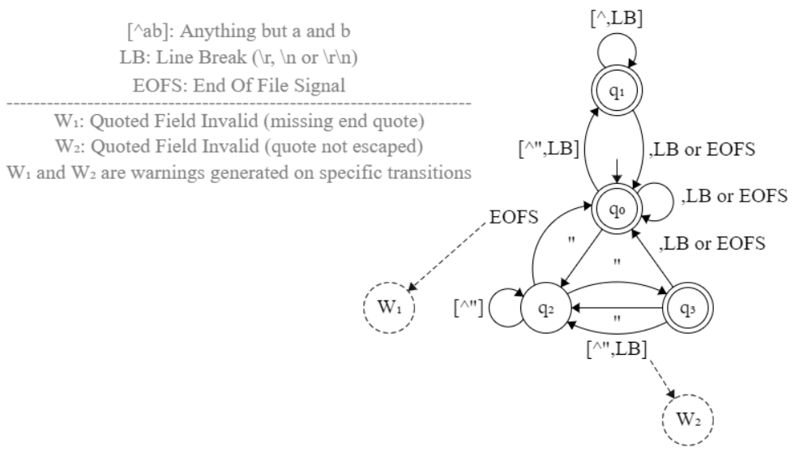

# Design and Implementation of a Streaming CSV Parser

- [Introduction](#introduction)
- [RFC 4180](#rfc-4180-to-the-rescue)
- [State machine](#towards-a-finite-state-machine)
- [Implementation](#the-csv-parser-in-javascript)
- [Performance](#benchmarking-and-performance)

## Introduction

This document outlines an educational approach to parsing Comma-Separated Values
(CSV) regardless of their source. Fundamentally, we create a streaming CSV
parser&mdash;a parser that can parse data incrementally as the data streams in,
correctly processing input provided in arbitrary-sized chunks. This contrasts
with parsers that expect the entire input as one big string or buffer before
parsing.

To increase the flexibility and usability of the parser, we ensure it conforms
to the requirements of a commonly used CSV format. Indeed, a naïve parser
implementation that simply splits comma-separated strings on commas would fail
to handle commas within fields, as in `a,"b,b",c` which contains three fields
instead of four, with the second field enclosed in double quotes.

In the next sections, we detail the CSV parser specification, followed by
implementation, testing and performance benchmarking.

## RFC 4180 to the rescue

This RFC documents a CSV format that appears to be supported by most CSV
parsers, and we adopt it for our purposes. All relevant details can be found in
Section 2 of the RFC: [Definition of the CSV Format](https://datatracker.ietf.org/doc/html/rfc4180#section-2).
Below, we present our interpretation of the seven requirements from that
section, extending them where appropriate.

### Interpreted requirements

#### R1 & R2

Lines in a CSV file are separated by a line break. The last line may or may not
have an ending line break. Each record is located on a line and consists of
fields separated by a comma.
- Line breaks are either `\r`, `\n` or `\r\n`, but they can be mixed within the
same CSV string.
- The field separator can be any character in addition to the comma, such as `;`
(semicolon), `\t` (tabulation), ` ` (space), `|` (pipe symbol), multiple spaces
instead of a tabulation, and more.

#### R6

Special characters in CSV context are line breaks, double quotes and field
separators (e.g., the comma). Fields containing such characters must be enclosed
in double quotes for those characters to lose their special meaning. For
example, a field separator enclosed in double quotes is treated as part of the
field, not as a separator.

#### R5 & R7

Each field may or may not be enclosed in double quotes. If a field is not
enclosed in double quotes, then double quotes may or may not appear inside the
field. However, if double quotes are used to enclose a field, then a double
quote appearing inside the field must be escaped by preceding it with another
double quote.

At this point, some clarifications are needed before we move on.
- How do we know if a field is enclosed in double quotes or not?
    - The question is easily answered for fields that do not start with a double
    quote, such as `a`, `ab`, `a"` or `a"b"`: they are not enclosed in double
    quotes. In other words, these fields are easily distinguished when separated
    by a comma (`a,ab,a",a"b"`).
    - Now consider `"a,bc` where a field starts with a double quote. One might
    be tempted to treat the comma as a field separator, interpreting the left
    side (`"a`) as a field not enclosed in double quotes. However, it is unclear
    whether a closing double quote was forgotten, in which case the intended
    field could be `"a"`, `"a,bc"` or `"a,bc..."` for example, which are valid
    double-quoted fields. Therefore, to avoid ambiguity, we require that open
    double quotes be properly terminated (`"..."`). In other words, the comma
    mentioned above is not a field separator, meaning that the field is intended
    to be enclosed in double quotes, but the closing double quote is missing.
- What about escaping a double quote appearing inside a double-quoted field?
Consider the following key examples: `"a""b"`, `"a""` and `"a"x`.
    - The first example is a valid double-quoted field representing `a"b`, where
    one double quote escapes the other.
    - The second example is invalid because we need to see the juxtaposed double
    quotes as an escape sequence; so the closing double quote is missing.
    - The last example is invalid because it contains a double quote that is not
    escaped by another double quote, contrary to requirements.

#### R3 & R4

These requirements describe the optional header line in a CSV file, establishing
that the header line fields must correspond in number and order to the fields in
the subsequent records.

In addition, *Spaces are considered part of a field and should not be ignored*.
The use of *should* here is interesting because it is debatable whether spaces
following a double-quoted string in a field (e.g., `"a"  `) must be considered
part of the field or ignored. In our case, we prefer not to ignore spaces,
particularly because the aforementioned field is treated as an unterminated
double-quoted field, as mentioned in the previous sections.

### Others

Errata for this RFC are accessible via the *View errata* link in the metadata
sidebar of the RFC and are available at [this page](https://www.rfc-editor.org/errata_search.php?rfc=4180).
You might also want to use [this link](https://www.rfc-editor.org/errata_search.php?rfc=4180&rec_status=0)
instead, to see only records whose status is Verified+Reported (meaning Verified
or Reported). No changes stated there contradict the choices we have made so far
regarding our CSV parser. You can also learn about the status and type of RFC
errata [here](https://www.rfc-editor.org/errata-definitions/).

Section 5 of the RFC highlights certain security considerations to bear in mind.
While these are covered in the *MIME Type Registration of text/csv* section
of he RFC (i.e., not in the section 2 of the RFC defining the CSV format), they
remain relevant, such as the risk of a malicious user exploiting a buffer
overflow vulnerability due to insufficient checks in server-side CSV parsing.

## Towards a finite state machine

After establishing the requirements for our CSV parser, we turn to illustrating
how to parse CSV lines before implementation, regardless of whether a header
line is present. The following is a pseudo-automaton for visualization only.
This screenshot was taken from the [nvc](https://github.com/arlogy/nvc) project
user interface, and JSON data is available below for import. Further details are
provided next.

<p align="center">
    
</p>

```json
{"fsmAlphabet":"","nodes":[{"x":615,"y":269,"text":"q_0","isAcceptState":true,"radius":25,"opacity":1,"dashesEnabled":false,"borderColor":"black","bgColor":"transparent","textColor":"black","readonly.isInitialState":true},{"x":545,"y":367,"text":"q_2","isAcceptState":false,"radius":25,"opacity":1,"dashesEnabled":false,"borderColor":"black","bgColor":"transparent","textColor":"black","readonly.isInitialState":false},{"x":615,"y":152,"text":"q_1","isAcceptState":true,"radius":25,"opacity":1,"dashesEnabled":false,"borderColor":"black","bgColor":"transparent","textColor":"black","readonly.isInitialState":false},{"x":685,"y":367,"text":"q_3","isAcceptState":true,"radius":25,"opacity":1,"dashesEnabled":false,"borderColor":"black","bgColor":"transparent","textColor":"black","readonly.isInitialState":false},{"x":685,"y":478,"text":"W_2","isAcceptState":false,"radius":25,"opacity":1,"dashesEnabled":true,"borderColor":"black","bgColor":"transparent","textColor":"black","readonly.isInitialState":true},{"x":390,"y":367,"text":"W_1","isAcceptState":false,"radius":25,"opacity":1,"dashesEnabled":true,"borderColor":"black","bgColor":"transparent","textColor":"black","readonly.isInitialState":true}],"links":[{"type":"StartLink","nodeIndex":0,"text":"","opacity":1,"dashesEnabled":false,"lineColor":"black","arrowColor":"black","textColor":"black","prefersNodeVisualAttrs":true,"deltaX":0,"deltaY":-49},{"type":"Link","nodeAIndex":0,"nodeAHasArrow":false,"nodeBIndex":1,"nodeBHasArrow":true,"text":"\"","opacity":1,"dashesEnabled":false,"lineColor":"black","arrowColor":"black","textColor":"black","lineAngleAdjust":0,"parallelPart":0.5405405405405405,"perpendicularPart":0},{"type":"Link","nodeAIndex":0,"nodeAHasArrow":false,"nodeBIndex":2,"nodeBHasArrow":true,"text":"[^\",LB]","opacity":1,"dashesEnabled":false,"lineColor":"black","arrowColor":"black","textColor":"black","lineAngleAdjust":3.141592653589793,"parallelPart":0.514792899408284,"perpendicularPart":-32},{"type":"SelfLink","nodeIndex":1,"nodeHasArrow":true,"text":"[^\"]","opacity":1,"dashesEnabled":false,"lineColor":"black","arrowColor":"black","textColor":"black","anchorAngle":3.141592653589793},{"type":"SelfLink","nodeIndex":2,"nodeHasArrow":true,"text":"[^,LB]","opacity":1,"dashesEnabled":false,"lineColor":"black","arrowColor":"black","textColor":"black","anchorAngle":-1.5707963267948966},{"type":"SelfLink","nodeIndex":0,"nodeHasArrow":true,"text":",LB or EOFS","opacity":1,"dashesEnabled":false,"lineColor":"black","arrowColor":"black","textColor":"black","anchorAngle":-0.17662423222323853},{"type":"Link","nodeAIndex":2,"nodeAHasArrow":false,"nodeBIndex":0,"nodeBHasArrow":true,"text":",LB or EOFS","opacity":1,"dashesEnabled":false,"lineColor":"black","arrowColor":"black","textColor":"black","lineAngleAdjust":3.141592653589793,"parallelPart":0.391304347826087,"perpendicularPart":-25},{"type":"Link","nodeAIndex":3,"nodeAHasArrow":false,"nodeBIndex":0,"nodeBHasArrow":true,"text":",LB or EOFS","opacity":1,"dashesEnabled":false,"lineColor":"black","arrowColor":"black","textColor":"black","lineAngleAdjust":0,"parallelPart":0.3339457691453492,"perpendicularPart":0},{"type":"Link","nodeAIndex":1,"nodeAHasArrow":false,"nodeBIndex":3,"nodeBHasArrow":true,"text":"\"","opacity":1,"dashesEnabled":false,"lineColor":"black","arrowColor":"black","textColor":"black","lineAngleAdjust":3.141592653589793,"parallelPart":0.7837837837837838,"perpendicularPart":-18},{"type":"Link","nodeAIndex":3,"nodeAHasArrow":false,"nodeBIndex":1,"nodeBHasArrow":true,"text":"\"","opacity":1,"dashesEnabled":false,"lineColor":"black","arrowColor":"black","textColor":"black","lineAngleAdjust":3.141592653589793,"parallelPart":0.3546099290780142,"perpendicularPart":0},{"type":"Link","nodeAIndex":3,"nodeAHasArrow":false,"nodeBIndex":1,"nodeBHasArrow":true,"text":"[^\",LB]","opacity":1,"dashesEnabled":false,"lineColor":"black","arrowColor":"black","textColor":"black","lineAngleAdjust":3.141592653589793,"parallelPart":0.40425531914893614,"perpendicularPart":-25},{"type":"StartLink","nodeIndex":4,"text":"","opacity":1,"dashesEnabled":false,"lineColor":"black","arrowColor":"black","textColor":"black","prefersNodeVisualAttrs":true,"deltaX":-37,"deltaY":-59},{"type":"Link","nodeAIndex":1,"nodeAHasArrow":false,"nodeBIndex":0,"nodeBHasArrow":true,"text":"EOFS","opacity":1,"dashesEnabled":false,"lineColor":"black","arrowColor":"black","textColor":"black","lineAngleAdjust":3.141592653589793,"parallelPart":0.4488416988416988,"perpendicularPart":-44.75534091637042},{"type":"StartLink","nodeIndex":5,"text":"","opacity":1,"dashesEnabled":false,"lineColor":"black","arrowColor":"black","textColor":"black","prefersNodeVisualAttrs":true,"deltaX":95,"deltaY":-84}],"textItems":[{"x":242,"y":183,"text":"W_1: Quoted Field Invalid (missing end quote)","opacity":1,"textColor":"gray"},{"x":242,"y":208,"text":"W_2: Quoted Field Invalid (quote not escaped)","opacity":1,"textColor":"gray"},{"x":242,"y":148,"text":"EOFS: End Of File Signal","opacity":1,"textColor":"gray"},{"x":242,"y":120,"text":"LB: Line Break (\\r, \\n or \\r\\n)","opacity":1,"textColor":"gray"},{"x":242,"y":94,"text":"[^ab]: Anything but a and b","opacity":1,"textColor":"gray"},{"x":242,"y":164,"text":"---------------------------------------------------------------------","opacity":1,"textColor":"gray"},{"x":242,"y":234,"text":"W_1 and W_2 are warnings generated on specific transitions","opacity":1,"textColor":"gray"}]}
```

`q0` is the initial state. When processing a string, we begin in the initial
state, read one character at a time, and transition to the next state based on
the input read. For example, in `q0`, if we read a comma, a line break (LB), or
reach the end of a file (EOFS), we remain in `q0`, otherwise we transition to
either `q2` or `q1`. The same logic applies to the other states. However, the
pseudo-automaton does not show what happens within each state after reading a
character and before transitioning to the next state, but the operations are
essentially detecting special CSV characters and accumulating characters to
create new fields and records, a record being an array of fields on a single
line.

When there are no characters left to read, the parser cannot automatically
detect the end of a file, since it parses CSV lines independently of their
source. To handle this, we introduced the *End Of File Signal* (EOFS) in the
pseudo-automaton. This signal can be implemented as an event or a function,
allowing the parser to create a new record even when the last line does not end
with a line break, such as at the end of a file.

## The CSV parser in JavaScript

- [Documentation and examples](https://github.com/arlogy/jsu/blob/main/doc/jsu_csv_parser.md)
- [Implementation](https://github.com/arlogy/jsu/blob/main/src/jsu_csv_parser.js)
- [Unit tests](https://github.com/arlogy/jsu/blob/main/tests/jsu_csv_parser.js)

## Benchmarking and Performance

### Preparation

Performance benchmarking is based on this [article](https://leanylabs.com/blog/js-csv-parsers-benchmarks/),
which provides a GitHub repository that we forked [here](https://github.com/arlogy/csv-parsers-benchmarks).

In the `README.md` file of the forked repository, you will notice that two
additional CSV parsers have been tested.
- Our CSV parser is part of a library called *jsu*. We will use this name to
refer to the parser throughout this section. Furthermore, we used version 1.5.1
of the parser during our benchmarking session; execution times may vary across
versions, but the ranking has remained consistent since version 1.0.0, the first
published version.
- The other parser, udsv, was benchmarked at version 0.7.3.

Besides, some of the tested parsers offer parsing options
([csv-parse](https://csv.js.org/parse/options/),
[csv-parser](https://github.com/mafintosh/csv-parser#csvoptions--headers),
[fast-csv](https://c2fo.github.io/fast-csv/docs/parsing/options/),
[jsu](https://github.com/arlogy/jsu/blob/main/doc/jsu_csv_parser.md#jsucsvpsroptions),
[paparse](https://www.papaparse.com/docs#config))
that were not evaluated during the benchmarks. As a result, enabling these
options may affect performance. For example, jsu allows multiple entries for
line and field separators; depending on the values of these separators, the
internal regular expression used during parsing may or may not be optimized, and
jsu can be compared to the other parsers only when an optimized regular
expression is in use, which occurs in one of the two configurations tested for
jsu during the benchmarks.

### Ranking methodology

During benchmarks, we observed that small speed variations (on the order of a
few milliseconds) tend to fluctuate between runs, thus changing which parser is
the fastest. Moreover, considering that a speed gain of 250 ms is barely
noticeable and does not meaningfully distinguish one parser from another, we
establish that two parsers are equivalent in speed if neither completes more
than 250 ms before the other.

However, parser equivalence is not necessarily transitive. For instance, if
parser `B` finishes up to 250 ms after parser `A`, parser `B` is not considered
slower, and both parsers receive the same rank (`rk`). Yet, if parser `C`
finishes up to 250 ms after parser `B` (i.e., `B` and `C` are also equivalent)
but more than 250 ms after parser `A` (i.e., `A` and `C` are not equivalent, and
`C` is slower than `A`), then parser `C` cannot share the same rank as `A` and
`B`. In that case, the next rank (`rk+1`) is assigned to `C`.

### Results

The execution times shown in parentheses (for both raw and quoted data below)
are expressed in milliseconds. They were measured from a single benchmarking
session and can vary significantly between runs, particularly on different
hardware configurations. Nevertheless, the ranking should remain fairly stable.

The benchmarking results are as follows.

#### Raw data

`raw_c_l` denotes a CSV file that does not contain double quotes and has `c`
columns and `l` lines. The benchmark results are summarized in the next
paragraph.
- `raw_10_10000`: 1. udsv (8.4) / 1. String.split (12.4) / 1. papaparse (18.1) / 1. dekkai (35.35) / 1. jsu-smart-on (35.55) / 1. csv-parser (51.85) / 1. csv-parse (65.2) / 1. fast-csv (100.05) / 1. jsu-smart-off (113.2)
- `raw_10_10000`: 1. udsv (87.6) / 1. String.split (94.5) / 1. papaparse (105.6) / 1. dekkai (236.5) / 1. jsu-smart-on (270.3) / 2. csv-parser (443) / 2. csv-parse (574.5) / 3. fast-csv (976) / 3. jsu-smart-off (1135.7)
- `raw_10_100000`: 1. udsv (108) / 1. String.split (140) / 1. papaparse (205.4) / 1. jsu-smart-on (348.2) / 2. csv-parser (696.8) / 2. csv-parse (809.4) / 3. fast-csv (1247) / 3. jsu-smart-off (1435)
- `raw_100_100000`: 1. udsv (883.4) / 1. String.split (1081.4) / 2. papaparse (1154.2) / 3. jsu-smart-on (2831) / 4. csv-parser (4736.6) / 5. csv-parse (5815.6) / 6. fast-csv (9806.4) / 7. jsu-smart-off (12524.8)

dekkai was not run in the last two tests because it would have crashed the
benchmarking process. String.split performed very well, but it can split a
string incorrectly, for example when the string contains complex Unicode
characters, as illustrated [here](https://stackoverflow.com/questions/30912663/sort-a-string-alphabetically-using-a-function/58220344#58220344).
Therefore, and considering only the result of the last test, udsv ranks first,
followed by papaparse which finished less than half a second behind. jsu comes
next, finishing less than two seconds after papaparse. The remaining parsers are
less competitive in terms of speed at this point, although csv-parser shows a
mere two-second delay behind jsu.

#### Quoted data

`quotes_c_l` denotes a CSV file containing double quotes, having `c` columns
and `l` lines. The benchmark results are summarized in the next paragraph.
- `quotes_10_10000`: 1. udsv (11.3) / 1. papaparse (34.9) / 1. dekkai (38.3) / 1. jsu-smart-on (50.55) / 1. csv-parser (58.15) / 1. csv-parse (67.1) / 1. jsu-smart-off (124.25) / 1. fast-csv (135.25)
- `quotes_100_10000`: 1. udsv (95.3) / 1. dekkai (252.7) / 1. papaparse (299.6) / 2. jsu-smart-on (411.4) / 2. csv-parser (510.7) / 2. csv-parse (585.7) / 3. jsu-smart-off (1094.1) / 3. fast-csv (1110)
- `quotes_10_100000`: 1. udsv (128.4) / 1. papaparse (337.4) / 2. jsu-smart-on (484) / 2. csv-parser (635.8) / 2. csv-parse (712) / 3. fast-csv (1296.8) / 3. jsu-smart-off (1330.6)
- `quotes_100_100000`: 1. udsv (1018) / 2. papaparse (3263.6) / 3. jsu-smart-on (4406.6) / 4. csv-parser (5456.8) / 5. csv-parse (6301.2) / 6. fast-csv (12434) / 7. jsu-smart-off (12904.8)

Again, dekkai was not run in the last two tests because it would have crashed
the benchmarking process. String.split is not applicable here because additional
code is needed to correctly parse quoted fields. Therefore, and considering only
the result of the last test, udsv remains the fastest CSV parser, followed by
papaparse which finished about two seconds behind. jsu comes next, finishing
approximately one second after papaparse. The remaining parsers are less
competitive in terms of speed at this stage, although csv-parser is only one
second slower than jsu.

#### Other facts

Surprisingly, the fast-csv parser is the slowest among those tested, but
examining its source code may help explain this performance gap. Moreover, some
parsers may be using Node.js worker threads to accelerate parsing; jsu does not.
It is also unclear whether all parsers are compliant with RFC 4180, with the
exception of jsu and papaparse.
